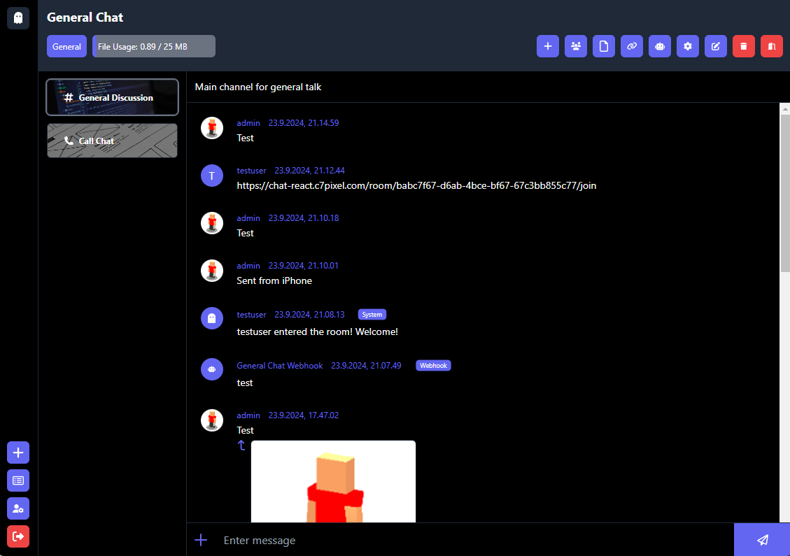

# Chat App React+TypeScript
A React.js SPA made for the chat backend application found at https://github.com/niiicolai/chat-app.

## Example


## Deployment Status
[](https://github.com/niiicolai/chat-app-react/actions/workflows/deploy_vm.yml)

## Features
| Feature                | Subfeature                   | Status  |
|------------------------|------------------------------|---------|
| **Mobile**             | Responsive                   | [x]     |
| **CSS Styles**         | Tailwind CSS                 | [x]     |
| **User**               | Login                        | [x]     |
|                        | Registration                 | [x]     |
|                        | Logout                       | [x]     |
|                        | Edit Profile                 | [x]     |
|                        | Status                       | [ ]     |
|                        | Delete Avatar                | [x]     |
|                        | Forgot password              | [x]     |
|                        | E-mail verification          | [x]     |
|                        | Two Factor Authentication    | [ ]     |
|                        | Google Sign up + Login       | [x]     |
|                        | Add/Revoke Google Login      | [ ]     |
| **Room**               | Create                       | [x]     |
|                        | Update                       | [x]     |
|                        | Delete                       | [x]     |
|                        | List                         | [x]     |
|                        | Select                       | [x]     |
|                        | Leave                        | [x]     |
|                        | Edit Settings                | [x]     |
|                        | Delete Avatar                | [x]     |
|                        | Total File Usage Overview    | [x]     |
|                        | Single File Setting Overview | [x]     |
|                        | Channel Usage Overview       | [x]     |
|                        | Room User Usage Overview     | [x]     |
|                        | File Retention Overview      | [x]     |
|                        | Message Retention Overview   | [x]     |
|                        | Display Rules Text           | [x]     |
|                        | Pagination                   | [x]     |
| **Room Invite Link**   | Create                       | [x]     |
|                        | Update                       | [x]     |
|                        | Delete                       | [x]     |
|                        | List                         | [x]     |
|                        | Join                         | [x]     |
|                        | Pagination                   | [x]     |
| **Room Files**         | List                         | [x]     |
|                        | Delete                       | [x]     |
|                        | Pagination                   | [x]     |
| **Room Users**         | Set to Admin                 | [x]     |
|                        | Set to Moderator             | [x]     |
|                        | Set to Member                | [x]     |
|                        | Kick                         | [x]     |
|                        | Client Role Check            | [x]     |
|                        | Pagination                   | [x]     |
| **Channel**            | Create                       | [x]     |
|                        | Update                       | [x]     |
|                        | Delete                       | [x]     |
|                        | List                         | [x]     |
|                        | Delete Avatar                | [x]     |
|                        | Pagination                   | [x]     |
| **Channel Webhook**    | Create                       | [x]     |
|                        | Update                       | [x]     |
|                        | Delete                       | [x]     |
|                        | List                         | [x]     |
|                        | Send Test Message            | [x]     |
|                        | Delete Avatar                | [x]     |
|                        | Pagination                   | [x]     |
| **Channel Message**    | Create                       | [x]     |
|                        | Update                       | [x]     |
|                        | Delete                       | [x]     |
|                        | List                         | [x]     |
|                        | Add File                     | [x]     |
|                        | Delete File                  | [x]     |
|                        | Scroll To Bottom Event       | [ ]     |
|                        | Pagination                   | [x]     |
| **Toast**              | Create                       | [x]     |
|                        | List                         | [x]     |
|                        | Delete                       | [x]     |
| **Websocket**          | Connect                      | [x]     |
|                        | Join Channel                 | [x]     |
|                        | Handle Message Events        | [x]     |
| **WebRTC**             | Connect                      | [ ]     |
|                        | Video Call                   | [ ]     |
|                        | Audio Call                   | [ ]     |
|                        | Screen Sharing               | [ ]     |
| **Logging**            | Rollbar                      | [x]     |
|                        | Uncaught Exceptions          | [x]     |
|                        | Unhandled Promise Rej.       | [x]     |
| **End2end tests**      | Login                        | [x]     |
|                        | Signup                       | [x]     |
|                        | Room                         | [x]     |
|                        | Join Room                    | [x]     |
|                        | Room Settings                | [x]     |
|                        | Room Invite Link             | [x]     |
|                        | Room User                    | [ ]     |
|                        | Room File                    | [ ]     |
|                        | Channel                      | [x]     |
|                        | Channel Message              | [ ]     |
|                        | Channel Message Upload       | [ ]     |
|                        | Channel Webhook              | [x]     |
|                        | User                         | [ ]     |
|                        | User Status                  | [ ]     |
| **Other tests**        | Unit tests                   | [ ]     |
|                        | Integration tests            | [ ]     |
| **Routing**            | React Router                 | [x]     |
|                        | Sitemap                      | [x]     |
| **CI/CD**              | GitHub Actions               | [x]     |
|                        | GitHub Secrets               | [x]     |
|                        | DigitalOcean                 | [x]     |
|                        | Docker Hub                   | [x]     |
| **Design**             | [Wireframe](wireframe-design.png)  | [x]     |

## Development Environment Setup
The following are the steps to set up the development environment for the chat client.

### Install
```
npm install
cp .env.example .env
```

### Run
```
npm run dev
```

### Unit and Integration Test (Vitest)
```
npm test
```

### End to End Test (Cypress)
```
npm run cy:open
```

### ESLint
```
npm run eslint
```

### Build Sitemap
```
npm run sitemap
```

### Build Static files
```
npm run build
```

## Docker
Build a Docker image using the project's Dockerfile.

### Build
```
docker build -t chat_react:v1.0 .
```

### Run in detached mode
```
docker run -d -p 5371:5371 chat_react:v1.0 
```

## Docker Compose
The project contains two Docker compose files:
- **[compose-hub-image.yml](https://github.com/niiicolai/chat-app-react/blob/main/compose-hub-image.yml)**: Fetches a prebuilt image from Docker Hub and starts the application. This image is designed for quick testing and expects the API to be available at http://localhost:3000 and the WebSocket server at ws://localhost:3001.
- **[compose-local-image.yml](https://github.com/niiicolai/chat-app-react/blob/main/compose-local-image.yml)**: Expects the machine to have a local Docker image of the application build. Refer to the section on building a Docker image before using this Compose file.

### Run *Docker Hub Image* in detached mode
```
docker-compose -f compose-hub-image.yml up -d
```

### Run *Local Docker Image* in detached mode
```
docker-compose -f compose-local-image.yml up -d
```
